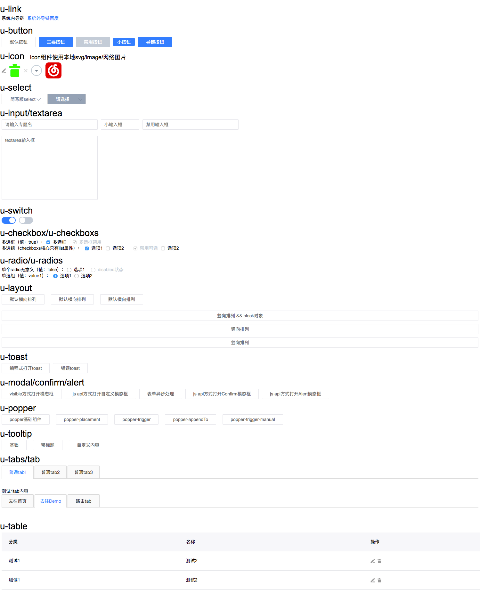

# yi-ui

a lightweight ui component for vue2.x
## Setup
```
npm install yi-ui
```

## Usage

``` js
import YIUI from 'yi-ui'
Vue.use(YIUI)
```

``` html
<u-link>click me</u-link>
<u-button color="primary">click me</u-button>
```

## Preview



## License

The code is distributed under the [MIT](http://opensource.org/licenses/MIT) license